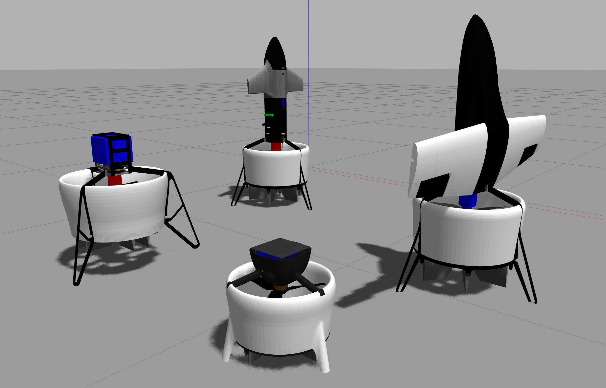

# DuctedFanUAV Autopilot

This repository is forked from [PX4-Autopilot](https://github.com/PX4/PX4-Autopilot.git) and holds the PX4 flight control solution for DuctedFanUAV.




## Featrue
Our development work is now mainly concentrated on the `df-1.x.x` branch, which is based on the `v1.x.x` version of PX4. The default branch `df-main`, which is based on the `main` branch of PX4 (from `df-1.15.4`).


* An angular velocity controller based on the [INDI control algorithm for DFUAV](https://github.com/mengchaoheng/DuctedFanUAV-Autopilot/tree/df-1.12.3/src/modules/mc_rate_control/IndiControl). (only `df-1.12.3`，more information can be found in [PINDI](https://github.com/mengchaoheng/PINDI))
* [Control allocator](https://github.com/mengchaoheng/DuctedFanUAV-Autopilot/blob/df-1.12.3/src/lib/mixer_module/ControlAllocation.h) based on linear programming algorithm. Currently only ductedfan4 is supported, but it can be easily changed to support other models. (only `df-1.12.3`，more information can be found in [PINDI](https://github.com/mengchaoheng/PINDI))
* Supported airframes:
  * ductedfan2: DFUAV with two control surfaces and two rotors.
  * ductedfan4: DFUAV with four control surfaces and one rotor.
  * ductedfan6: DFUAV with six control surfaces and one rotor.
  * ductedfan_mini: mini DFUAV with four control surfaces and one rotor.
  * SHC09
  * SHW09_vtol (from `df-1.15.4`)
  * Multirotor with tilt (from `df-1.15.4`)
  * ToDo: many more experimental types based on Ducted Fan.
* Supports gazebo-based simulation ([Gazebo Classic](https://docs.px4.io/main/en/sim_gazebo_classic/)) and can easily communicate with the ros package. We implement DuctedFanUAV simulation by modifying the gazebo model and plugins, more detail in [DF_gazebo](https://github.com/mengchaoheng/DF_gazebo.git) which forked from [PX4-SITL_gazebo-classic](https://github.com/PX4/PX4-SITL_gazebo-classic.git) (sitl_gazebo).
* We have performed extensive flight tests with DuctedFanUAV equipped with Pixhawk.


## Installation
Before running this project, you need to deploy the development environment. Please refer to the [PX4 official website](https://docs.px4.io/main/en/) (`main`) to ensure that your computer (macOS/Linux) can open the default model simulation by executing the `make px4_sitl gazebo-classic` command and take off through QGC or terminal commands. It's recommended to use Ubuntu 20.04 and QGC 5.x.

> It's easy to upgrade this project to the latest version of px4, just make sure that the [Gazebo Classic environment](https://docs.px4.io/main/en/sim_gazebo_classic/#installation) is deployed in a supported ubuntu version, but we need a lot of testing before doing so.

> Due to [Ubuntu 22.04 or later with Arm64 architecture cannot install gazebo](https://github.com/osrf/gazebo_tutorials/pull/169), the gazebo classical may not run on arm64-based Ubuntu 22 and later versions. However, AMD64 (x86-64) should still support it. As long as the px4 official gazebo classical simulation can run, the code in this repository can be executed. Most users do not need to pay attention to this. We will soon migrate to the latest gz simulation.

The [PX4 User Guide](https://docs.px4.io/master/en/) explains how to assemble [supported vehicles](https://docs.px4.io/master/en/airframes/airframe_reference.html) and fly drones with PX4.
See the [forum and chat](https://docs.px4.io/master/en/#support) if you need help!

For Ubuntu 20.04, installing the simulation environment is quite straightforward:
1. Install git:

```bash
sudo apt install git
```

2. Clone code:

```bash
git clone https://github.com/mengchaoheng/DuctedFanUAV-Autopilot --recursive
```

3. Go to the path of the code:

```bash
cd DuctedFanUAV-Autopilot
```

4. Run the ubuntu.sh with no arguments (in a bash shell) to install everything:

```bash
# For arm64-based ubuntu. See https://github.com/PX4/PX4-Autopilot/issues/21117
bash ./Tools/setup/ubuntu.sh
```

Or download the development environment deployment script from the official website.

```bash
wget https://raw.githubusercontent.com/PX4/PX4-Autopilot/main/Tools/setup/ubuntu.sh
wget https://raw.githubusercontent.com/PX4/PX4-Autopilot/main/Tools/setup/requirements.txt
bash ubuntu.sh
```

5. Start Gazebo SITL using the following command:


5.1 Test the built-in quadcopter simulation:

```bash
make px4_sitl gazebo-classic
```
5.2 Test the simulation of this project:
```bash
make px4_sitl gazebo-classic_ductedfan4
```

> **Note:**  In Ubuntu 22.04 and higher versions, Gazebo Classic is no longer supported on arm64 Ubuntu. If Gazebo was installed using a script on amd64 Ubuntu, it needs to be uninstalled and reinstalled：
```bash
sudo apt remove gz-harmonic
sudo apt install aptitude
sudo aptitude install gazebo libgazebo11 libgazebo-dev
```

## Usage
Clone this repository:
```
git clone https://github.com/mengchaoheng/DuctedFanUAV-Autopilot.git

cd DuctedFanUAV-Autopilot
```

Make sure you're on the `df-main` branch. You can use `git status` to check it.
```
git checkout df-main
```

Ensure that the required submodules for loading the `df-main` branch are loaded.
```
git submodule update --init --recursive
```

> Note: If submodule update error, first switch to `main`, then run the above command, and then switch back to `df-main`, and then run the aforementioned command to update submodules.

When switching branches or wishing to recompile, you can use
```
make distclean
```
to keep a clean compilation, and then run
```
git submodule update --init --recursive

```
again to rebuild, The compilation command is as follows.

> **Note:** px4 is not sensitive to the Python environment, but you need to ensure that you have installed the required Python packages. Refer to [Development Environment Deployment](https://docs.px4.io/main/en/dev_setup/dev_env.html)
### Simulation
1. ductedfan2
```
make px4_sitl gazebo-classic_ductedfan2
```
2. ductedfan4
```
make px4_sitl gazebo-classic_ductedfan4
```
3. ductedfan6
```
make px4_sitl gazebo-classic_ductedfan6
```
4. ductedfan_mini
```
make px4_sitl gazebo-classic_ductedfan_mini
```
5. SHC09
```
make px4_sitl gazebo-classic_SHC09
```
6. SHW09_vtol
```
make px4_sitl gazebo-classic_SHW09_vtol
```
7. Multirotor with tilt
```
make px4_sitl gazebo-classic_tilt_multirotor
```
### Flight with pixhawk

Taking pixhawk 4 as an example, the upload command is:

```
make px4_fmu-v5 upload
```
Other versions are similar, please refer to the official website for more details.
