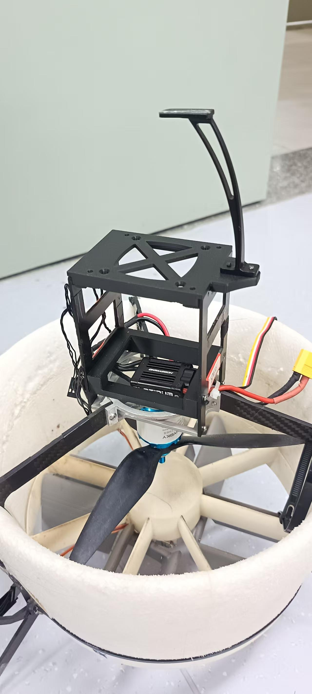
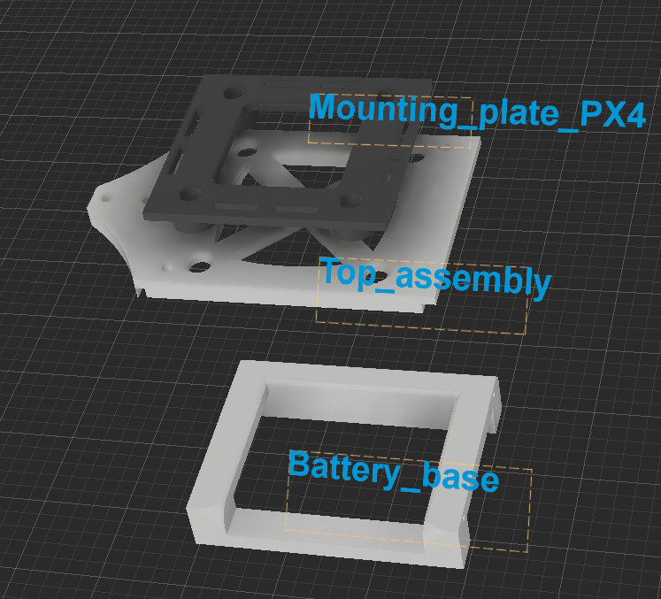

# DuctedFanUAV 3D 打印结构件

本目录存放了为 [DuctedFanUAV-Autopilot](https://github.com/mengchaoheng/DuctedFanUAV-Autopilot) 项目配套设计的 3D 打印结构件。这些部件用于将飞控、电池、GPS 等电子设备集成到涵道风扇无人机机身上，采用模块化设计，便于快速原型迭代和部件更换。

## 📦 部件清单
“组合体” 文件包含所有内容，可直接导入切片软件打印，或单独使用对应部件

| 部件名称 | 文件 | 功能描述 |
| :--- | :--- | :--- |
| **组合体** | `DF_3dprint.stl` | 完整内容文件 |
| **电池底座** | `battery_base.stl` | 为电池提供放置平面，并为侧面结构提供装配孔位 |
| **顶部总成** | `top_assembly.stl` | 提供平台与侧面结构装配，设有 6mm 减震器安装孔位及 GPS 天线固定座 |
| **PX4 固定板** | `px4_mounting_plate.stl` | 底部预留 6mm 减震球孔位，上表面平整用于粘接 PX4 飞控 |

## 🧩 部件详细说明

### 1. 电池底座 (`battery_base.stl`)

该部件位于机身底部，承担电池并将其与底部结构隔离。

- **电池尺寸**：76mm * 76mm * 76mm
- **装配接口**：侧面设有与侧面结构（碳纤维板或 3D 打印侧板）对应的装配孔位（孔径M1.5, 孔间距46mm（圆心））。
- **安装建议**：使用 M1.5 （GB或Din）进行固定，电池使用扎带捆绑。

### 2. 顶部总成 (`top_assembly.stl`)

该部件位于机身顶部，是飞控、GPS 等设备的主要承载平台。

- **平台结构**：平整的上表面，与侧面结构通过预留孔位进行装配（孔径M1.5, 孔间距46mm（圆心））。
- **减震器安装位**：设有 4 个 6mm 减震器（或减震球）的安装孔位，用于为飞控平台提供隔振，减少涵道风扇高频振动对 IMU 的干扰。
- **GPS 天线固定座**：预留了两个孔位（孔径M3, 孔间距11mm（圆心）），可安装GPS固定座，方便固定天线模块。
- **安装建议**：减震器建议选用 6mm 孔径的硅胶减震球。

### 3. PX4 固定板 (`px4_mounting_plate.stl`)

该部件是飞控的安装板，用于将 PX4 飞控（如 Pixhawk 4、Pixhawk Mini 等）固定到减震平台上。

- **上表面**：光滑平整，设计用于粘接飞控（推荐使用 3M 泡棉双面胶或减震胶垫）。
- **下表面**：预留 4 个 6mm 减震球安装孔位，与顶部总成的减震器位点对应。
- **安装建议**：先将减震球安装在固定板底部，再将固定板卡入顶部总成的安装孔位中，最后将飞控粘贴在固定板上表面。

## 🖨️ 打印建议

| 参数 | 推荐值 |
| :--- | :--- |
| **材料** | PETG |
| **层高** | 0.2 mm |
| **填充率** | 15%，非承力件可适当降低 |
| **支撑** | 不需要 |
| **壁厚** | ≥ 3 层外壳（Wall Loops） |

## 🔧 装配概览
