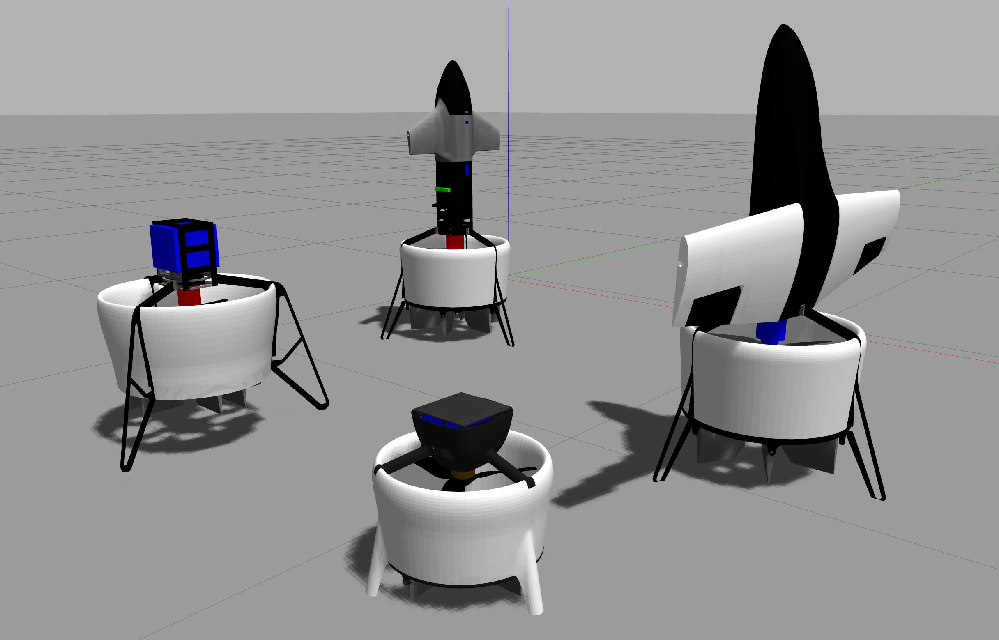

# DuctedFanUAV Autopilot

This repository is forked from [PX4-Autopilot](https://github.com/PX4/PX4-Autopilot.git) and holds the PX4 flight control solution for DuctedFanUAV.




## Feature
Development is now centered on the `df-main` branch, which tracks PX4 `main` after the `df-1.15.4` migration. The older `df-1.x.x` branches keep the PX4-versioned history, including the early `df-1.12.3` INDI and LPCA work documented in [PINDI](https://github.com/mengchaoheng/PINDI).

Compared with the upstream PX4 baseline around commit `82e3322e0cf0afc9ad640f37a0a8b639077b3fa4`, this workspace adds three connected pieces:

* Ducted-fan control: [df_hover_rate_control](src/modules/df_hover_rate_control) is derived from PX4 `mc_rate_control`. It keeps the normal angular-rate PID fallback, adds angular-rate INDI, and publishes separate force/torque setpoints for the ducted-fan dual-instance allocation layout. The INDI acceleration-to-thrust correction is integrated in [mc_pos_control](src/modules/mc_pos_control). The controller design follows **Full-Mode Flight Control Framework for a Ducted-Fan Tail-Sitter UAV**.
* LPCA/PCA control allocation: [ControlAllocationLPCA.cpp](src/lib/control_allocation/control_allocation/ControlAllocationLPCA.cpp) adapts INV/DP_LPCA/DPscaled_LPCA/PCA to PX4, and [pca/ControlAllocation.h](src/lib/control_allocation/control_allocation/pca/ControlAllocation.h) contains the bounded LP implementation. The allocation algorithms follow **Aircraft control allocation** and the reference implementation in [control_allocation](https://github.com/mengchaoheng/control_allocation).
* Ducted-fan effectiveness backends: [ActuatorEffectivenessDuctedFan.cpp](src/modules/control_allocator/VehicleActuatorEffectiveness/ActuatorEffectivenessDuctedFan.cpp) supports non-VTOL ducted-fan airframes, and [ActuatorEffectivenessDuctedFanTailsitterVTOL.cpp](src/modules/control_allocator/VehicleActuatorEffectiveness/ActuatorEffectivenessDuctedFanTailsitterVTOL.cpp) supports ducted-fan tailsitter VTOL. These backends provide the physical force/torque effectiveness matrices used by allocation feedback and INDI.

Supported Gazebo Classic airframes include `ductedfan2`, `ductedfan4`, `ductedfan6`, `ductedfan_mini`, `SHC09`, `SHW09_vtol`, and `tilt_multirotor`. See [airframe startup scripts](ROMFS/px4fmu_common/init.d-posix/airframes) and [SITL targets](src/modules/simulation/simulator_mavlink/sitl_targets_gazebo-classic.cmake).

The simulator includes Gazebo Classic ducted-fan dynamics in [ductedfan_plugin.cpp](Tools/simulation/gazebo-classic/sitl_gazebo-classic/src/ductedfan_plugin/ductedfan_plugin.cpp), with spline-based duct/wing aerodynamics and a control-surface moment model.


## Design Summary
The implementation deliberately separates allocation, feedback, and INDI:

* Allocation algorithms are generic. `CA_METHOD` can select INV/DP_LPCA/DPscaled_LPCA/PCA for any configured effectiveness matrix, not only ducted-fan airframes.
* Physical allocation feedback is restricted to ducted-fan airframes. [AllocationValue](msg/AllocationValue.msg) publishes physical `B`, `u`, and filtered actuator feedback only for `CA_AIRFRAME=16/17`, because INDI needs correctly scaled physical units.
* INDI is a ducted-fan control feature. It is enabled by `DF_USE_INDI` or `DF_USE_ACC_INDI`, then gated by recent allocation feedback with the required force or torque authority.

This keeps aircraft-specific meaning out of the allocation algorithms. The controller and effectiveness backend decide what the setpoints and matrices mean; the allocator only solves the bounded allocation problem.

### Allocation Methods
PX4 upstream provides pseudo-inverse, sequential desaturation, and `AUTO`. This workspace adds `INV`, `DP_LPCA`, `DPscaled_LPCA`, and `PCA` to `CA_METHOD`.

`CA_METHOD` applies to every allocation instance. If `CA_METHOD=AUTO`, the selected `CA_AIRFRAME` backend supplies its desired method per instance. Otherwise, each instance uses the same selected method.

The LPCA/PCA adapter works on the normalized PX4 allocation contract:

```text
v = B_phys u_phys
u_phys = U u_norm
v_norm = D v = D B_phys U u_norm = B_norm u_norm
```

Here `U` maps normalized actuator commands to physical actuator units, and `D = diag(_control_allocation_scale)` unitizes the control axes. PID controllers already output normalized setpoints. INDI computes physical angular acceleration and then publishes the normalized equivalent.

The LPCA/PCA path builds:

```text
B_norm = D B_phys U
find u_norm within actuator bounds so B_norm u_norm tracks v_norm_cmd
```

Current LPCA/PCA applicability:

* active rows: 2 to 6
* actuators: 2 to 16
* actuators must be at least active rows
* active rows must be full-row-rank

Fallback behavior:

* `solver_status = unavailable`: matrix is unsuitable, such as rank deficient, fewer than two active rows, more active rows than actuators, or unsupported dimensions.
* `solver_status = failed`: LPCA/PCA dispatch or solver failed for the bounded problem.
* `fallback = 1`: the allocator then runs the internal `INV` path and still produces actuator commands.
* `solver_status = accepted_err`: solver reported an error code, but the residual check accepted the result, so this is not the fallback path.

PCA adds high/low priority semantics. The solver interface is generic, but this workspace currently defines only the three-dimensional torque split generated by angular-rate INDI:

```text
higher = INDI torque feedback
lower  = rate-error torque feedback
```

[ControlAllocator.cpp](src/modules/control_allocator/ControlAllocator.cpp) only passes that split to PCA when the target allocation matrix is torque-only and the torque split is valid. Otherwise PCA degenerates to `higher = 0, lower = total_command`; if LPCA/PCA is unsuitable it falls back to `INV`.

### Allocation Feedback
There are two feedback layers.

[ControlAllocatorStatus](msg/ControlAllocatorStatus.msg) is public allocator status for all airframes. It reports allocation success, unallocated torque/thrust, saturation state, and allocation runtime:

```text
allocation_running_time
allocation_running_time_avg
allocation_running_time_samples
```

[AllocationValue](msg/AllocationValue.msg) is ducted-fan physical feedback for INDI and diagnostics. It is published only when:

```text
CA_AIRFRAME is 16 or 17
control allocation output publishing is enabled
the allocation instance exists
```

It contains the selected method, fallback flag, solver diagnostics, physical `B`, normalized and physical actuator output, filtered actuator feedback, and per-instance allocation runtime. `feedback_valid` means the allocation instance has at least one configured actuator; it does not mean INDI is automatically valid. INDI still checks force or torque authority.

### INDI Conditions And Feedback
Angular-rate INDI lives in [df_hover_rate_control](src/modules/df_hover_rate_control) and is enabled by `DF_USE_INDI`. The module is a ducted-fan version of `mc_rate_control`: it keeps the PID rate-control fallback and adds physical INDI feedback.

For non-VTOL ducted-fan aircraft, `df_hover_rate_control` publishes force and torque setpoints to separate uORB instances:

```text
instance 0: thrust / force setpoint
instance 1: torque setpoint
```

This mirrors the two allocation matrices. For ducted-fan tailsitter VTOL, the module is started with the `vtol` argument and publishes to the VTOL virtual multicopter setpoint topics. This is intentional: MC, transition, and FW phases can keep the same ducted-fan MC-rate controller path at the actuator-control level, while the VTOL attitude layer and the effectiveness backend change the setpoints and matrix with flight phase.

Angular-rate INDI reads `allocation_value` instance 1. It enters INDI only when:

* `DF_USE_INDI=1`
* instance 1 feedback is recent, with timestamp younger than 500 ms
* `feedback_valid=true`
* torque rows 0, 1, and 2 each have at least one finite nonzero effectiveness entry

Its feedback extraction is:

```text
Bu = B_torque * u_ultimate_phys
indi_fb = Bu - angular_accel
error_fb = Kp * (rate_sp - rate)
torque_phys = error_fb + indi_fb
torque_norm = D_torque * torque_phys
```

It publishes `torque_norm` as the torque setpoint, with `error_fb` as the lower-priority component and `indi_fb` as the higher-priority component for PCA.

Acceleration INDI lives in [mc_pos_control](src/modules/mc_pos_control) and is enabled by `DF_USE_ACC_INDI` while flying. It reads `allocation_value` instance 0 and enters only when that feedback is recent and has force authority in rows 3 to 5.

Its feedback extraction is:

```text
force_body = B_force * actuator_feedback
thrust_acc_feedback = R_to_ned * force_body / DF_ACC_MASS
thrust_acc_sp = thrust_acc_feedback + (acc_sp - acc_meas)
```

For non-reversible motors it applies the same `THR_MDL_FAC` inverse used by the motor output model before reconstructing physical thrust feedback. If any required feedback is unavailable, `mc_pos_control` keeps the normal PX4 acceleration-to-thrust path.

### Ducted-Fan Effectiveness
`CA_AIRFRAME=16` uses [ActuatorEffectivenessDuctedFan.cpp](src/modules/control_allocator/VehicleActuatorEffectiveness/ActuatorEffectivenessDuctedFan.cpp). It creates two allocation matrices by design:

* instance 0: motor force allocation, with propeller torque disabled
* instance 1: control-surface torque allocation

The current ducted-fan aircraft are physically decoupled this way, and PCA currently has only a torque priority split. Keeping force and torque in separate matrices makes instance 1 torque-only, so PCA can use `INDI torque > rate-error torque` without inventing a force priority policy.

`CA_AIRFRAME=17` uses [ActuatorEffectivenessDuctedFanTailsitterVTOL.cpp](src/modules/control_allocator/VehicleActuatorEffectiveness/ActuatorEffectivenessDuctedFanTailsitterVTOL.cpp). It inherits PX4's tailsitter two-instance structure and adjusts the surface matrix by flight phase: hover can disable wing elevons outside the duct slipstream, while transition/FW can scale duct tail-surface authority with `DF_FW_CS_GAIN`.

If a future ducted-fan geometry has motors or surfaces that both produce force and torque, the two-instance assumption is no longer valid. That future geometry should use one allocation matrix and PCA should first be extended to multi-level priorities, for example:

```text
force > INDI torque > rate-error torque
```

## Installation
Before running this project, you need to deploy the development environment. Please refer to the [PX4 official website](https://docs.px4.io/main/en/) (`main`) to ensure that your computer (macOS/Linux) can open the default model simulation by executing the `make px4_sitl gazebo-classic` command and take off through QGC or terminal commands. It's recommended to use Ubuntu 20.04 and QGC 5.x.

> It's easy to upgrade this project to the latest version of px4, just make sure that the [Gazebo Classic environment](https://docs.px4.io/main/en/sim_gazebo_classic/#installation) is deployed in a supported ubuntu version, but we need a lot of testing before doing so.

> Due to [Ubuntu 22.04 or later with Arm64 architecture cannot install gazebo](https://github.com/osrf/gazebo_tutorials/pull/169), Gazebo Classic may not run on arm64-based Ubuntu 22 and later versions. However, AMD64 (x86-64) should still support it. As long as the PX4 official Gazebo Classic simulation can run, the code in this repository can be executed. Most users do not need to pay attention to this. We will soon migrate to the latest gz simulation.

The [PX4 User Guide](https://docs.px4.io/main/en/) explains how to assemble [supported vehicles](https://docs.px4.io/main/en/airframes/airframe_reference) and fly drones with PX4.
See the [forum and chat](https://docs.px4.io/main/en/#support) if you need help!

For Ubuntu 20.04, installing the simulation environment is quite straightforward:
1. Install git:

```bash
sudo apt install git
```

2. Clone code:

```bash
git clone https://github.com/mengchaoheng/DuctedFanUAV-Autopilot --recursive
```

3. Go to the path of the code:

```bash
cd DuctedFanUAV-Autopilot
```

4. Run the ubuntu.sh with no arguments (in a bash shell) to install everything:

```bash
# For arm64-based ubuntu. See https://github.com/PX4/PX4-Autopilot/issues/21117
bash ./Tools/setup/ubuntu.sh
```

Or download the development environment deployment script from the official website.

```bash
wget https://raw.githubusercontent.com/PX4/PX4-Autopilot/main/Tools/setup/ubuntu.sh
wget https://raw.githubusercontent.com/PX4/PX4-Autopilot/main/Tools/setup/requirements.txt
bash ubuntu.sh
```

5. Start Gazebo SITL using the following command:


5.1 Test the built-in quadcopter simulation:

```bash
make px4_sitl gazebo-classic
```
5.2 Test the simulation of this project:
```bash
make px4_sitl gazebo-classic_ductedfan4
```

> **Note:**  In Ubuntu 22.04 and higher versions, Gazebo Classic is no longer supported on arm64 Ubuntu. If Gazebo was installed using a script on amd64 Ubuntu, it needs to be uninstalled and reinstalled:
```bash
sudo apt remove gz-harmonic
sudo apt install aptitude
sudo aptitude install gazebo libgazebo11 libgazebo-dev
```

## Usage
Clone this repository:
```
git clone https://github.com/mengchaoheng/DuctedFanUAV-Autopilot.git

cd DuctedFanUAV-Autopilot
```

Make sure you're on the `df-main` branch. You can use `git status` to check it.
```
git checkout df-main
```

Ensure that the required submodules for loading the `df-main` branch are loaded.
```
git submodule update --init --recursive
```

> Note: If submodule update error, first switch to `main`, then run the above command, and then switch back to `df-main`, and then run the aforementioned command to update submodules.

When switching branches or wishing to recompile, you can use
```
make distclean
```
to keep a clean compilation, and then run
```
git submodule update --init --recursive

```
again to rebuild, The compilation command is as follows.

> **Note:** px4 is not sensitive to the Python environment, but you need to ensure that you have installed the required Python packages. Refer to [Development Environment Deployment](https://docs.px4.io/main/en/dev_setup/dev_env)
### Simulation
1. ductedfan2
```
make px4_sitl gazebo-classic_ductedfan2
```
2. ductedfan4
```
make px4_sitl gazebo-classic_ductedfan4
```
3. ductedfan6
```
make px4_sitl gazebo-classic_ductedfan6
```
4. ductedfan_mini
```
make px4_sitl gazebo-classic_ductedfan_mini
```
5. SHC09
```
make px4_sitl gazebo-classic_SHC09
```
6. SHW09_vtol
```
make px4_sitl gazebo-classic_SHW09_vtol
```
7. Multirotor with tilt
```
make px4_sitl gazebo-classic_tilt_multirotor
```
### Flight with pixhawk

Taking pixhawk 4 as an example, the upload command is:

```
make px4_fmu-v5 upload
```
Other versions are similar, please refer to the official website for more details.
