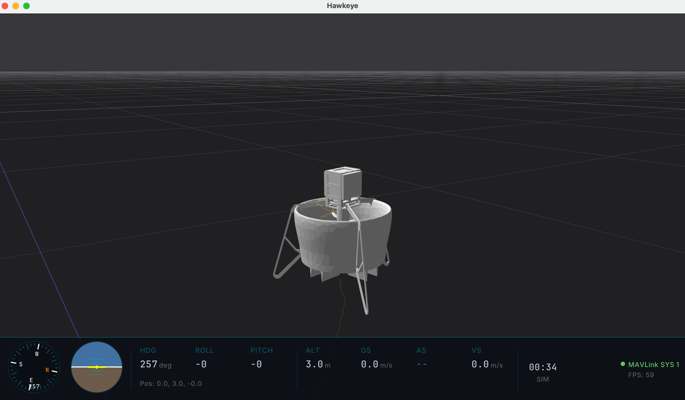
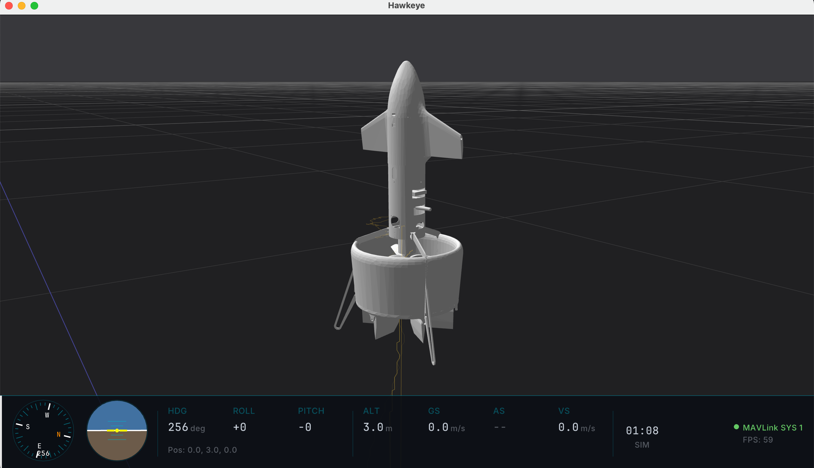
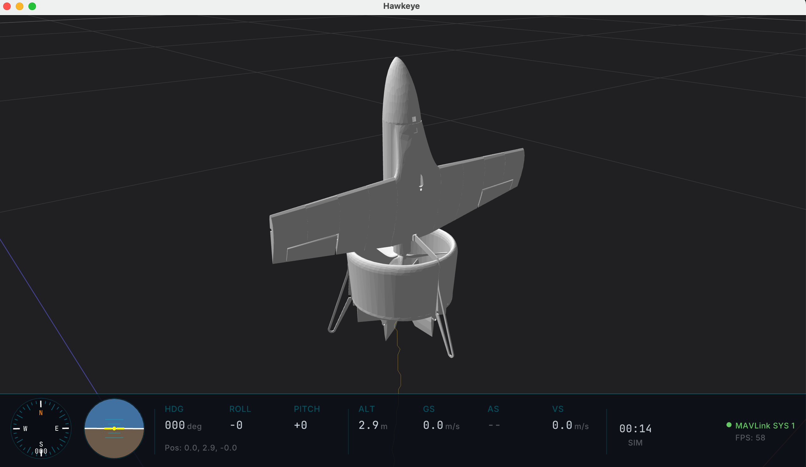
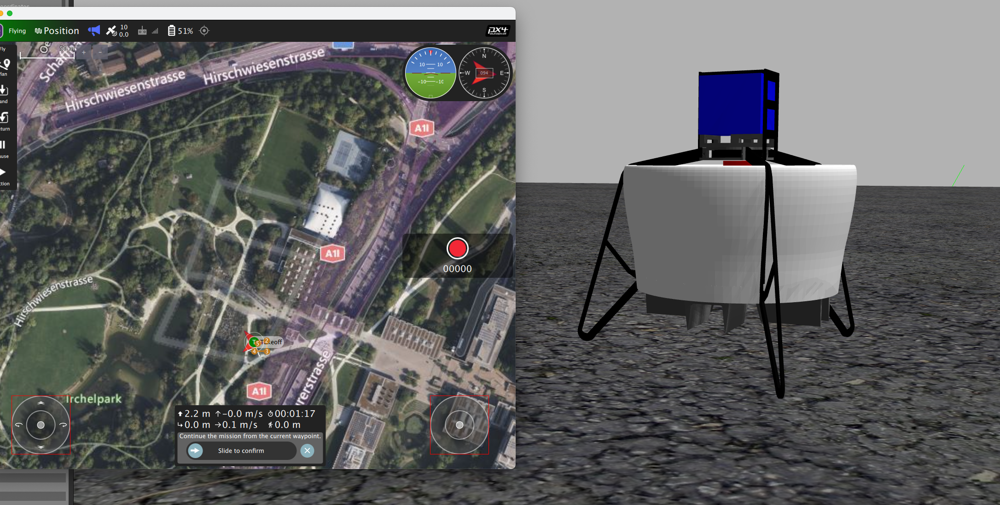
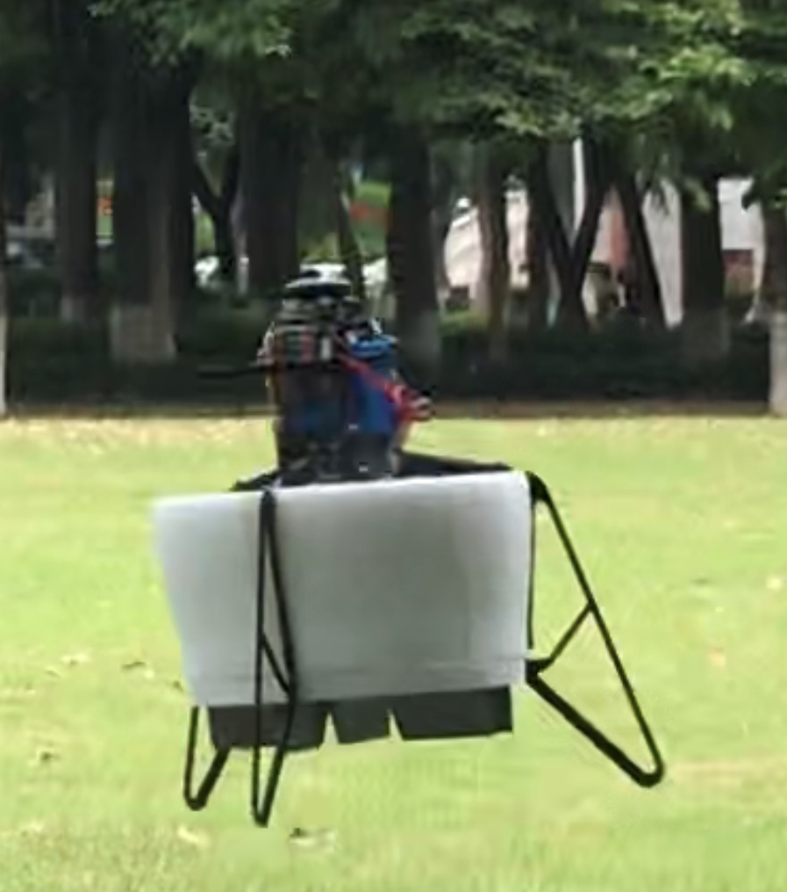

# DuctedFanUAV Autopilot

This repository is forked from [PX4-Autopilot](https://github.com/PX4/PX4-Autopilot.git) and holds the PX4 flight control solution for DuctedFanUAV.


## Feature
Development is now centered on the `df-main` branch, which tracks PX4 `main` after the `df-1.15.4` migration. The older `df-1.x.x` branches keep the PX4-versioned history, including the early `df-1.12.3` INDI and LPCA work documented in [PINDI](https://github.com/mengchaoheng/PINDI).

Compared with the upstream PX4 baseline around commit `82e3322e0cf0afc9ad640f37a0a8b639077b3fa4`, this workspace adds five connected pieces:

* INDI control: the generic angular-rate law is integrated directly into PX4 [mc_rate_control](src/modules/mc_rate_control), which keeps the normal angular-rate PID fallback and supports an explicit MC torque-allocation matrix route. The acceleration-to-thrust correction is integrated in [mc_pos_control](src/modules/mc_pos_control). The controller design follows **Full-Mode Flight Control Framework for a Ducted-Fan Tail-Sitter UAV**.
* Selectable attitude errors: [mc_att_control](src/modules/mc_att_control) adds the `MC_ATT_ERR_MODE` parameter for selecting among eight attitude-error formulations, including the PX4 reduced-attitude method, quaternion and SO(3) logarithm methods, DCM vee error, Tal-Karaman incremental error, tilt-prioritized quaternion error, and Yu tilt-torsion error. The default value `0` preserves the original PX4 behavior.
* LPCA/PCA control allocation: [ControlAllocationLPCA.cpp](src/lib/control_allocation/control_allocation/ControlAllocationLPCA.cpp) adapts INV/DP_LPCA/DPscaled_LPCA/PCA to PX4, and [pca/ControlAllocation.h](src/lib/control_allocation/control_allocation/pca/ControlAllocation.h) contains the bounded LP implementation. The allocation algorithms follow **Aircraft control allocation** and the reference implementation in [control_allocation](https://github.com/mengchaoheng/control_allocation).
* Ducted-fan effectiveness backends: [ActuatorEffectivenessDuctedFan.cpp](src/modules/control_allocator/VehicleActuatorEffectiveness/ActuatorEffectivenessDuctedFan.cpp) supports non-VTOL ducted-fan airframes, and [ActuatorEffectivenessDuctedFanTailsitterVTOL.cpp](src/modules/control_allocator/VehicleActuatorEffectiveness/ActuatorEffectivenessDuctedFanTailsitterVTOL.cpp) supports ducted-fan tailsitter VTOL. These backends provide the physical force/torque effectiveness matrices used by allocation feedback and INDI.

* SIH simulation: [simulator_sih](src/modules/simulation/simulator_sih) runs lightweight rigid-body physics inside PX4, including Iris, DF4, SHC09, and SHW09. Physical model parameters are independent of control allocation parameters. SIH is recommended for everyday controller development; Gazebo (gz) and Gazebo Classic remain equally important for scene/sensor simulation and comparison against plugin-based dynamics. See [Simulation](#simulation).

Both Gazebo Classic and Gazebo (gz) support `ductedfan2`, `ductedfan4`, `ductedfan6`, `ductedfan_mini`, `SHC09`, and `SHW09_vtol`. The tilted vehicle is named `tilt_multirotor` in Gazebo Classic and `tiltrotor` in gz. See the [airframe startup scripts](ROMFS/px4fmu_common/init.d-posix/airframes), [Gazebo Classic SITL targets](src/modules/simulation/simulator_mavlink/sitl_targets_gazebo-classic.cmake), and [gz models](Tools/simulation/gz/models).

The simulator includes Gazebo Classic ducted-fan dynamics in [ductedfan_plugin.cpp](Tools/simulation/gazebo-classic/sitl_gazebo-classic/src/ductedfan_plugin/ductedfan_plugin.cpp), with spline-based duct/wing aerodynamics and a control-surface moment model.

## Control Allocation and INDI

The physical-unit conventions, normalized control allocation, feedback semantics, INDI laws, PCA conditions, MC/VTOL instance routing, and current applicability limits are documented in [Control Allocation and INDI Integration](CONTROL_ALLOCATION_AND_INDI.md).

## Installation

**SIH needs the PX4 build tools, but does not need Gazebo Classic or Gazebo (gz).** For a simple desktop setup, use the SIH-only instructions below. Install an external simulator only when you want to run its models.

### Ubuntu: minimal SIH setup

Use Ubuntu 22.04 or 24.04 with the setup script included in this repository.

1. Get the source code and submodules:

   ```bash
   sudo apt update
   sudo apt install -y git
   git clone --recursive --branch df-main https://github.com/mengchaoheng/DuctedFanUAV-Autopilot.git
   cd DuctedFanUAV-Autopilot
   ```

2. Install only the desktop build dependencies:

   ```bash
   bash ./Tools/setup/ubuntu.sh --no-sim-tools --no-nuttx
   ```

   `--no-sim-tools` skips Gazebo/gz installation. `--no-nuttx` skips the embedded toolchain: omit this second option if you also want to build Pixhawk firmware, including SIH on hardware:

   ```bash
   bash ./Tools/setup/ubuntu.sh --no-sim-tools
   ```

   Use the script from this checkout so its dependencies match the source. See the [PX4 Ubuntu setup guide](https://docs.px4.io/main/en/dev_setup/dev_env_linux_ubuntu) for platform details.

3. Restart the computer after setup, open a terminal in `DuctedFanUAV-Autopilot`, and build/start SIH:

   ```bash
   make px4_sitl_sih sihsim_iris
   ```

   QGC can connect to the running simulation for flight control. For optional 3D visualization, use [Hawkeye](https://github.com/mengchaoheng/Hawkeye); see [Hawkeye visualization](#hawkeye-visualization). Neither is needed to compile PX4.

### Optional: Gazebo (gz) or Gazebo Classic

For **Gazebo (gz)** on Ubuntu 22.04/24.04, run the setup script with simulator installation enabled, then restart:

```bash
bash ./Tools/setup/ubuntu.sh --no-nuttx
```

Omit `--no-nuttx` if you also need the Pixhawk toolchain. You can run this command later after starting with SIH-only development.

For **Gazebo Classic**, use the [PX4 Gazebo Classic setup instructions](https://docs.px4.io/main/en/sim_gazebo_classic/). The project's established Classic environment uses Ubuntu 20.04; the current repository setup script installs gz Harmonic, **not Classic**. Classic support also depends on the OS and CPU architecture.

Once the chosen backend is installed, these commands all start **Iris**:

```bash
# SIH: recommended lightweight starting point
make px4_sitl_sih sihsim_iris

# Gazebo Classic
make px4_sitl gazebo-classic_iris

# Gazebo (gz)
make px4_sitl gz_iris
```

The target prefix selects the simulator (`sihsim_`, `gazebo-classic_`, or `gz_`); the suffix selects the aircraft. Replace `iris` with `ductedfan4` to run DF4. More models are listed below.

### macOS and existing checkouts

For this project's macOS build environment, follow [venv_readme.md](venv_readme.md). SIH also needs no Gazebo installation on macOS; the Ubuntu setup commands above are Linux-only.

If you already have the repository, use your existing checkout. After switching branches, update its submodules before building:

```bash
git submodule update --init --recursive
```

## Usage

### Simulation

SIH, Gazebo (gz), and Gazebo Classic are supported simulation options. **Start with SIH for everyday controller development**: it runs physics inside PX4, starts quickly, and does not require an external physics engine. Use gz for its scene and sensor simulation capabilities, and Gazebo Classic for the project's established custom aerodynamic plugins. The three backends serve complementary purposes; SIH does not replace the Gazebo models.

| Backend | Main use | Physics / visualization |
|---|---|---|
| **SIH (recommended starting point)** | PID/INDI development with a compact, adjustable physical model | Physics inside PX4; optional Hawkeye viewer |
| **Gazebo (gz)** | World, sensor, and vehicle simulation | External Gazebo engine and GUI |
| **Gazebo Classic** | Custom ducted-fan dynamics in SITL, plus HITL for selected aircraft | External Classic engine and GUI; USB/serial link for HITL |

Gazebo Classic also supports [HITL on a physical flight controller](#gazebo-classic-hitl-hardware-in-the-loop). For routine on-board control development, hardware SIH is recommended because the physics/control loop does not cross the host-to-flight-controller serial link.

#### SIH: supported aircraft and startup

Run the following commands from the PX4 project root. Model names are case-sensitive.

| Aircraft | Command | Physical model |
|---|---|---|
| Iris | `make px4_sitl_sih sihsim_iris` | Four parallel rotors, squared-speed thrust, independent motor positions |
| DF4 | `make px4_sitl_sih sihsim_ductedfan4` | Simplified rotor, slipstream, and four control vanes |
| SHC09 | `make px4_sitl_sih sihsim_SHC09` | Dedicated Gazebo Classic plugin equations and spline coefficients |
| SHW09 VTOL | `make px4_sitl_sih sihsim_SHW09_vtol` | Simplified duct drive with six vanes and an equivalent whole-wing model |

The built-in SIH targets also remain available:

| Built-in model | Command |
|---|---|
| Quadrotor | `make px4_sitl_sih sihsim_quadx` |
| Fixed-wing airplane | `make px4_sitl_sih sihsim_airplane` |
| Tailsitter | `make px4_sitl_sih sihsim_xvert` |
| Standard VTOL | `make px4_sitl_sih sihsim_standard_vtol` |
| Hexacopter | `make px4_sitl_sih sihsim_hex` |
| Ackermann rover | `make px4_sitl_sih sihsim_rover_ackermann` |

The four project SIH desktop airframes enable rate and acceleration INDI (`MC_INDI_RATE_EN=1`, `MPC_INDI_ACC_EN=1`), with the built-in PID fallback retained. DF4, SHC09 and SHW09 inherit Gazebo Classic gains and filters; Iris uses the gz Iris rate gains (15/15/4) and 20 Hz angular-acceleration/allocated-torque filters. SIH overrides the feedback alignment delays below. These are desktop starting values for hover and position-step flight, not a universal optimum or a Pixhawk timing calibration.

| SIH aircraft | `MC_INDI_T_DLY` (s) | `MPC_INDI_F_DLY` (s) |
|---|---:|---:|
| Iris | 0.004 | 0.020 |
| DF4 | 0.028 | 0.030 |
| SHC09 | 0.022 | 0.000 |
| SHW09 VTOL (multicopter flight) | 0.025 | 0.045 |

Each feedback path keeps its existing filtering plus one configurable delay. The OM controller retains its separate configuration; these two delays belong to `mc_rate_control` and `mc_pos_control`. Saved parameter overrides take precedence over airframe defaults. After starting the selected SIH model, adopt only these new delay defaults in the PX4 shell with `param reset MC_INDI_T_DLY MPC_INDI_F_DLY` while disarmed; use `param show` to check the effective values. Existing saved INDI enable switches and gains are not reset by that command.

**Model and parameter conventions**

`SIH_VEHICLE_TYPE` selects the physical model: `6=DF4`, `7=SHW09`, `8=SHC09`, `9=Iris`; original types `0..5` remain available. There is no additional `SIH_CLASSIC` switch.

| Parameter group | Meaning |
|---|---|
| `SIH_MASS`, `SIH_IXX/IYY/IZZ`, `SIH_IXY/IXZ/IYZ` | Mass and inertia tensor |
| `SIH_T_MAX` | Maximum per-rotor thrust for Iris and the simplified DF models; thrust scales with squared normalized motor speed |
| `SIH_Q_MAX` | Iris maximum per-rotor reaction torque; squared-speed scaling and fixed signs `+,+,-,-` |
| `SIH_R0_X/Y` through `SIH_R3_X/Y` | Iris physical motor positions relative to the center of mass, body FRD coordinates, metres |
| `SIH_T_TAU`, `SIH_SV_TAU` | One motor time constant for both rise and fall; separate duct-vane servo lag |
| `SIH_DF_WASH/KV/RAD/ARM/ANG` | DF4/SHW09 slipstream speed, vane force coefficient, radius, axial arm, and maximum deflection |
| `SIH_W_LIFT/DRAG/CTRL` | SHW09 wing lift, drag, and elevon-effectiveness multipliers |
| `SIH_KDV/KDW` | Built-in linear translational and rotational damping |

The physical model does not read `CA_ROTOR*` parameters. SIH parameters describe the simulated aircraft; `CA_*` parameters describe the controller's allocation model. Their initial values can match, but changing allocation tuning must not change the physical plant.

DF4/SHW09 vane flow combines body air-relative velocity with rotor-induced axial flow; vane forces contribute both lateral force and force-arm moments. SHW09 uses one equivalent wing with lift/drag, stall, elevon effects, and aerodynamic rate moments, including forward-flight roll damping. SHC09 retains its dedicated plugin equations without additional aerodynamic tuning multipliers. Its thrust law is not replaced by `SIH_T_MAX`.

Sensor-noise amplitudes are adjustable through `SIH_ACC_XY/Z`, `SIH_GYRO_XY/Z`, `SIH_ASPD_STD`, `SIM_MAG_STD_XY/Z`, `SIM_BARO_STD/DRIFT`, and `SIM_GPS_P_XY/P_Z/V_XY/V_Z/P_T/V_T`. White-noise amplitudes are per-sample standard deviations; GPS also has configurable correlation times. The shared GPS, barometer, and magnetometer settings apply to users of those simulation modules. Parameter descriptions and units are in the corresponding simulation module YAML files.

#### Hawkeye visualization

SIH aircraft displayed in Hawkeye (click a screenshot to view it at full resolution):

| DF4 | SHC09 | SHW09 VTOL |
|---|---|---|
| [](docs/assets/ductedfan/sih_hawkeye_df4.png) | [](docs/assets/ductedfan/sih_hawkeye_shc09.png) | [](docs/assets/ductedfan/sih_hawkeye_shw09.png) |

Use the project's modified [Hawkeye](https://github.com/mengchaoheng/Hawkeye). Follow its build instructions, then start the viewer in another terminal from the Hawkeye repository:

```bash
./build/hawkeye
```

For desktop SIH, PX4 sends visualization data from UDP `19450` to Hawkeye's default UDP `19410` (both offset by the PX4 instance number). QGC connects separately on `14550`. **QGC forwarding is not required for SIH SITL.** Hawkeye only renders the aircraft; it does not calculate physics. The modified receiver filters non-autopilot heartbeats so QGC's own heartbeat cannot select the aircraft model group. For SHW09, the vehicle heartbeat selects the tailsitter group; press **M** to cycle to `SHW09_vtol`.

For SIH running on Pixhawk hardware, select the corresponding SIH airframe (`1106` Iris, `1107` DF4, `1108` SHC09, `1109` SHW09) with firmware containing `simulator_sih`. Connect USB to QGC and enable QGC MAVLink forwarding to `127.0.0.1:19410` for Hawkeye visualization. QGC forwarding is one-way: the USB stream must already contain the required attitude/position messages, including `HIL_STATE_QUATERNION` if simulation ground truth is desired. Do not rely on Hawkeye requests traversing that forwarding link. Hardware physical defaults are provided; desktop results do not establish on-board timing or complete controller-configuration equivalence.

References: [PX4 SIH](https://docs.px4.io/main/en/sim_sih/), [SIH on hardware](https://docs.px4.io/main/en/sim_sih/hardware), and [QGC MAVLink forwarding](https://docs.qgroundcontrol.com/Stable_V5.0/en/qgc-user-guide/settings_view/mavlink.html).

#### Gazebo (gz) and Gazebo Classic

Both external simulators remain supported alongside SIH. Install the corresponding simulator before running these targets.

| Aircraft | Gazebo (gz) | Gazebo Classic |
|---|---|---|
| Iris | `make px4_sitl gz_iris` | `make px4_sitl gazebo-classic_iris` |
| DF2 | `make px4_sitl gz_ductedfan2` | `make px4_sitl gazebo-classic_ductedfan2` |
| DF4 | `make px4_sitl gz_ductedfan4` | `make px4_sitl gazebo-classic_ductedfan4` |
| DF6 | `make px4_sitl gz_ductedfan6` | `make px4_sitl gazebo-classic_ductedfan6` |
| Mini ducted fan | `make px4_sitl gz_ductedfan_mini` | `make px4_sitl gazebo-classic_ductedfan_mini` |
| SHC09 | `make px4_sitl gz_SHC09` | `make px4_sitl gazebo-classic_SHC09` |
| SHW09 VTOL | `make px4_sitl gz_SHW09_vtol` | `make px4_sitl gazebo-classic_SHW09_vtol` |
| Tilt vehicle | `make px4_sitl gz_tiltrotor` | `make px4_sitl gazebo-classic_tilt_multirotor` |

DF4 in Gazebo Classic, with QGroundControl telemetry:



### Flight with pixhawk

DF4 during an outdoor flight:



Taking pixhawk 4 as an example, the upload command is:

```
make px4_fmu-v5 upload
```
Other versions are similar, please refer to the official website for more details.

### Gazebo Classic HITL (Hardware-in-the-Loop)

The repository includes Gazebo Classic HITL models and flight-controller airframes for the following aircraft. HITL runs the PX4 flight stack on Pixhawk while Gazebo Classic runs the vehicle physics on the computer.

| Aircraft / configuration | `SYS_AUTOSTART` | Gazebo Classic world |
|---|---|---|
| Quadrotor X / Iris | `1001` | [hitl_iris.world](Tools/simulation/gazebo-classic/sitl_gazebo-classic/worlds/hitl_iris.world) |
| Project Iris OM-MPC configuration | `1004` | [hitl_iris.world](Tools/simulation/gazebo-classic/sitl_gazebo-classic/worlds/hitl_iris.world) |
| Standard VTOL QuadPlane | `1002` | [hitl_standard_vtol.world](Tools/simulation/gazebo-classic/sitl_gazebo-classic/worlds/hitl_standard_vtol.world) |
| DuctedFan4 | `1003` | [hitl_ductedfan4.world](Tools/simulation/gazebo-classic/sitl_gazebo-classic/worlds/hitl_ductedfan4.world) |

These configurations use `SYS_HITL=1`. Select the matching airframe and world, and set the actual USB serial device in that world's HITL model SDF. The supported SITL aircraft list does not imply a matching HITL configuration for every model.

**HITL latency and the recommended workflow:** in Gazebo Classic HITL, simulated sensor data travels from the computer to Pixhawk, and actuator commands travel back over USB/serial. Both transfers are inside the feedback loop. Transport, buffering, and host scheduling add latency and jitter; in this project's usage, that makes HITL less convenient than SIH for fast inner-loop tuning. The exact delay depends on the computer, message rates, and link configuration.

For everyday PID/INDI development on Pixhawk, **prefer hardware SIH (`SYS_HITL=2`)**: physics and control run on the board, so no external serial round trip is required for the simulated sensor/actuator feedback. Hawkeye/QGC traffic is used for visualization and operation rather than calculating the physical feedback. SIH still retains its configured actuator lag and sensor processing. Use Gazebo Classic HITL when the external aerodynamic plugins, environment, or hardware communication path are part of what you need to exercise; gz and Gazebo Classic SITL remain important complementary options.

The following procedure uses DuctedFan4 and Pixhawk 4 as the example. For other flight controller boards, refer to the [PX4 HITL documentation](https://docs.px4.io/main/en/simulation/hitl).

#### DF4 first-time setup

1. For FMUv5, ensure that `boards/px4/fmu-v5/default.px4board` contains:

   ```text
   CONFIG_MODULES_SIMULATION_PWM_OUT_SIM=y
   ```

   Build and upload the firmware:

   ```bash
   make px4_fmu-v5_default upload
   ```

2. First calibrate the sensors and radio using any normal airframe. Then select the DF4 HITL airframe from the QGC Parameters page:

   ```text
   SYS_AUTOSTART = 1003
   SYS_HITL      = 1
   ```

   Restart the flight controller after changing these parameters. The graphical airframe selection page in QGC is not required.

3. Build Gazebo Classic:

   ```bash
   DONT_RUN=1 make px4_sitl_default gazebo-classic
   ```

4. Identify the flight controller USB serial port during the first setup. Close QGC, then run the appropriate command both before and after connecting the flight controller.

   macOS:

   ```bash
   ls /dev/tty.usbmodem*
   ```

   Ubuntu/Linux:

   ```bash
   dmesg | grep tty
   ls -l /dev/serial/by-id/
   ```

   The macOS device may be `/dev/tty.usbmodem01`, while Linux commonly uses `/dev/ttyACM0`. Set the detected path in:

   ```text
   Tools/simulation/gazebo-classic/sitl_gazebo-classic/models/ductedfan4_hitl/ductedfan4_hitl.sdf
   ```

   ```xml
   <serialDevice>/dev/tty.usbmodem01</serialDevice>
   ```

5. In QGC, disable automatic Pixhawk USB and serial connections, leaving only UDP enabled. After this configuration, QGC can remain open: Gazebo owns the USB serial port and forwards the connection to QGC over UDP port 14550.

6. Set up the Gazebo environment and start DF4 HITL:

   ```bash
   # Run from the repository root
   source Tools/simulation/gazebo-classic/setup_gazebo.bash \
       "$(pwd)" \
       "$(pwd)/build/px4_sitl_default"

   gazebo Tools/simulation/gazebo-classic/sitl_gazebo-classic/worlds/hitl_ductedfan4.world
   ```

#### Starting DF4 HITL after the first-time setup

1. Connect the flight controller and turn on the transmitter.
2. In a terminal where `setup_gazebo.bash` has already been sourced, run:

   ```bash
   gazebo Tools/simulation/gazebo-classic/sitl_gazebo-classic/worlds/hitl_ductedfan4.world
   ```

3. Use QGC with only its UDP connection enabled. In a new terminal, source `setup_gazebo.bash` again before starting Gazebo. If the USB device name changes, update `serialDevice` in the SDF file accordingly.
