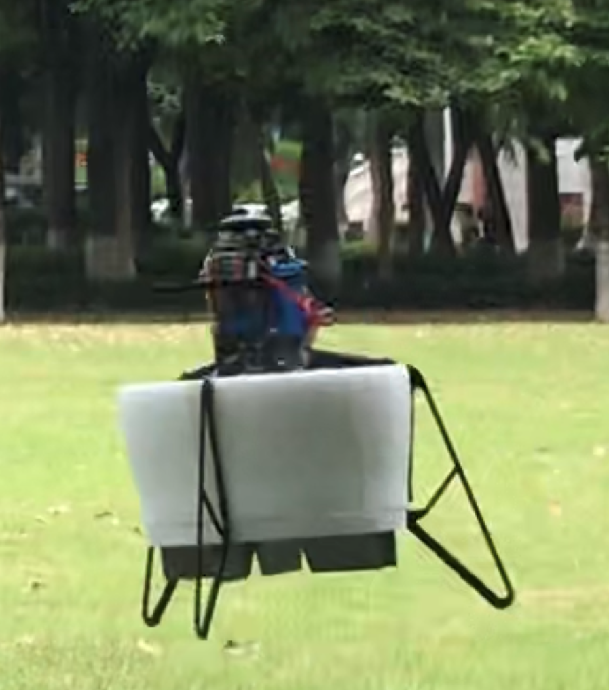

# DuctedFanUAV Autopilot

This repository forked from [PX4-Autopilot](https://github.com/PX4/PX4-Autopilot.git) for holds the PX4 flight control solution for DuctedFanUAV. It also contains the INDI controller, and a control allocator based on [Library of Control Allocation Algorithms](https://github.com/mengchaoheng/control_allocation.git).


## Featrue
Our development work is now mainly concentrated on the df-1.12.3 branch, based on the v1.12.3 version of px4.
* An angular velocity controller based on the [INDI control algorithm for DFUAV](https://github.com/mengchaoheng/DuctedFanUAV-Autopilot/tree/df-1.12.3/src/modules/mc_rate_control/IndiControl).
* [Control allocator](https://github.com/mengchaoheng/DuctedFanUAV-Autopilot/blob/df-1.12.3/src/lib/mixer_module/ControlAllocation.h) based on linear programming algorithm. Currently only ductedfan4 is supported, but it can be easily changed to support other models.
* Supported airframes:
  * ductedfan2: DFUAV with two control surfaces and two rotors.
  * ductedfan4: DFUAV with four control surfaces and one rotor.
  * ductedfan6: DFUAV with six control surfaces and one rotor.
  * ductedfan_mini: mini DFUAV with four control surfaces and one rotor.
  * ToDo: many more experimental types based on Ducted Fan.
* Supports gazebo-based simulation and can easily communicate with the ros package. We implement DuctedFanUAV simulation by modifying the gazebo model and plugins, more detail in [DF_gazebo](https://github.com/mengchaoheng/DF_gazebo.git) which forked from [PX4-SITL_gazebo-classic](https://github.com/PX4/PX4-SITL_gazebo-classic.git) (sitl_gazebo).
* We have performed extensive flight tests with DuctedFanUAV equipped with Pixhawk.



## Installation
Before running this project, you need to deploy the development environment. Please refer to the [PX4 official website](https://docs.px4.io/v1.12/en/) (v1.12) to ensure that your computer (macOS/Linux) can open the default model simulation by executing the `make px4_sitl gazebo` command and take off through QGC or terminal commands.

> It's easy to upgrade this project to the latest version of px4, but we need a lot of testing before doing so.


The [PX4 User Guide](https://docs.px4.io/master/en/) explains how to assemble [supported vehicles](https://docs.px4.io/master/en/airframes/airframe_reference.html) and fly drones with PX4.
See the [forum and chat](https://docs.px4.io/master/en/#support) if you need help!


## Usage
### Simulation
1. ductedfan2
```
make px4_sitl gazebo_ductedfan2
```
2. ductedfan4
```
make px4_sitl gazebo_ductedfan4
```
3. ductedfan6
```
make px4_sitl gazebo_ductedfan6
```
4. ductedfan_mini
```
make px4_sitl gazebo_ductedfan_mini
```
### Flight with pixhawk

Taking pixhawk 4 as an example, the upload command is:

```
make px4_fmu-v5 upload
```
Other versions are similar, please refer to the official website for more details.
